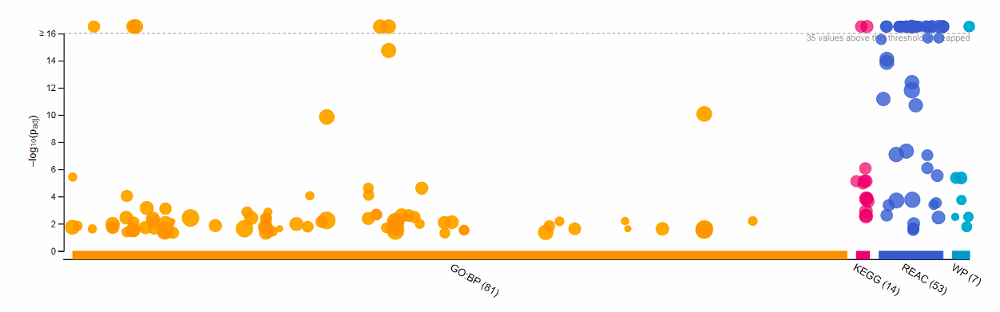

Important Note: In case of execution issue due to "cannot open file" error, please download source files from Github folder [A2_resources](https://github.com/bcb420-2022/Karen_Kuang/tree/main/A2_resources)

## Introduction ##
Data cleaning and normalization have been performed on a RNAseq dataset produced by a recent paper titled **Skeletal muscle transcriptome in healthy aging**, published in *Nature Communications* in 2021. The raw data was obtained from GEO with the ID **GSE164471** See the short bio below for some basic information of this dataset and its source.
#### <span style="text-decoration:underline">Dataset Meta Info</span> 
**Contact Location** : 251 Bayview Blvd,Baltimore,USA \
**Contact Institute** : NIA-IRP, NIH \
**Contact Department** : Laboratory of Genetics and Genomics \
**Contact Laboratory** : Computational Biology & Genomics Core

There are two supplemental files in this dataset: \
1). Genes/RNAs (ENSG) — GSE164471_GESTALT_Muscle_ENSG_counts_annotated.csv \
2). Transcripts/isoforms (ENST) — GSE164471_GESTALT_Muscle_ENST_TPM_annotated.csv \
In this study, the authors defined ENSGs as genes/RNAs and ENSTs as transcripts/isoforms. For the purpose of our analysis, we will focus on RNA data.

```{r Loading libraries & datasets, echo=FALSE, message=FALSE, results='hide'}
if (!requireNamespace("BiocManager", quietly = TRUE))
    invisible(install.packages("BiocManager"))

if (!requireNamespace("edgeR", quietly = TRUE))
    invisible(BiocManager::install("edgeR"))

if (!requireNamespace("DESeq2", quietly = TRUE))
    invisible(BiocManager::install("DESeq2"))

if (!requireNamespace("kableExtra", quietly = TRUE))
    invisible(BiocManager::install("kableExtra"))

if (!requireNamespace("circlize", quietly = TRUE))
    invisible(BiocManager::install("circlize"))

if (!requireNamespace("gplots", quietly = TRUE))
    invisible(BiocManager::install("gplots"))

if (!requireNamespace("RColorBrewer", quietly = TRUE))
    invisible(BiocManager::install("RColorBrewer"))

invisible(library(BiocManager))
invisible(library(knitr))
invisible(library(kableExtra))
invisible(library(ggplot2))
invisible(library(dplyr))
invisible(library(edgeR))
invisible(library(DESeq2))
invisible(library(biomaRt))
invisible(library(stats))
invisible(library(circlize))
library(gplots) #heat map function
library(RColorBrewer) #color palette for heat map
```

## Part 1: Differential Gene Expression ##

### 1.1 —— Load normalized count data 
* Gene expression data is obtained from [Skeletal muscle transcriptome in healthy aging](https://www.nature.com/articles/s41467-021-22168-2#citeas)[@tumasian2021skeletal].

- Original raw data contains:\
**57773** protein-coding and non-coding RNAs across 53 healthy individuals (22-83 years old) \

- Filtered data with weakly expressed (low counts) genes removed contains\
**36084** protein-coding and a few non-coding RNAs across 53 healthy individuals (22-83 years old)
```{r Load processed data}
# RNAfilered <- read.table("https://github.com/bcb420-2022/Karen_Kuang/blob/main/A2_resources/RNAfiltered_mapped.txt", check.names = FALSE,sep = "\t") 
# Unsure why this does not work. Messes up txt file content and format. 

RNAfiltered <- read.table("A2_resources/RNAfiltered_mapped.txt", check.names = FALSE)
#RNAfiltered <- read.table("A2_resources/RNAfiltered_mapped.txt", check.names = FALSE)

# Column 2 ~ 54 represent individual study participant (the first column contains the ensemble IDs). BEWARE that the last 10 columns contain other info regarding RNAs in the Ensembl hg19 v82 (September 2015) database.
# colnames(RNAfile)

# Number of study participants we have : (53)
length(grep(colnames(RNAfiltered), pattern = "MUSCLE",ignore.case = TRUE))
# Number of unique genes before cleaning: (57773)
# Number of unique genes after filtering: (36084)
length(RNAfiltered$ensembl_gene_id)
RNAfiltered[1:3,1:3]


# Load normalized count data for filtered genes. The trimmed mean method (TMM) was used for normalization.

# Restore proper formatting from text file
norm_count <- read.table("A2_resources/normalized_counts.txt", check.names = FALSE)
# norm_count <- read.table("A2_resources/normalized_counts.txt", check.names = FALSE)
colnames(norm_count) <- norm_count[1, 1:ncol(norm_count)]
rownames(norm_count) <- norm_count[1:nrow(norm_count), 1]
norm_count <- norm_count[-1,-1]

norm_count[1:3,1:3]
```

### 1.2 —— Revisit Graphical Data Summary (MDS plot)
```{r Graphical Data Summary (MDS plot)}
# First define the grouping of samples: 
grouping <-data.frame(lapply(colnames(norm_count),
                                      FUN=function(x){unlist(strsplit(x, split = "_"))[c(3,4)]}))
colnames(grouping) <- colnames(norm_count)
rownames(grouping) <- c("sex","age")
grouping <- data.frame(t(grouping))

filtered_RNA_matrix <- as.matrix(RNAfiltered[3:55])
filtered_RNA_matrix[1:3,1:3]

# Create the DEGList object and calculate normalization factors:
d = DGEList(counts=filtered_RNA_matrix, group=grouping$age)
d = calcNormFactors(d, method = "TMM") #trimmed mean method 

short <- sapply(strsplit(colnames(RNAfiltered)[2:54], split = "_"), 
                function(x) paste(x[4], collapse = '_'))

# No clear cluster by age group...
plotMDS(data.matrix(norm_count), labels=short, cex=0.6,
        col=c("blue", "green", "pink", "red", "black")[factor(grouping$age)])
title(main = "MDS plot -- Group by Age") 
legend("topleft", legend=c("Age 20~34", "Age 35~49", "Age 50~64", "Age 65~79", "Age > 80"), fill=c("blue", "green", "pink", "red", "black"), cex=0.8)


# No clustering by sex either...
plotMDS(data.matrix(norm_count), labels=short, cex=0.8,
        col=c("pink", "blue")[factor(grouping$sex)])
title(main = "MDS plot --- Group by Sex") 
legend("topleft", legend=c("Female", "Male"), fill=c("pink", "blue"), cex=0.8)

# hmm.., sex and age are the only covariates used in this experiment, so this RNA-seq data must be very dispersed
```

### 1.3 —— Model Designs
#### Part I : Genewise Negative Binomial Generalized Linear Models with Quasi-likelihood Tests
```{r Model Design I.1}
### GENERALIZED LINEAR MODEL using Age & Sex 
model_design <- model.matrix(~grouping$age+grouping$sex+0)
kable(model_design[1:5, 1:6], type = "html") %>% kableExtra::row_spec(0, angle=-20)
        
# Estimate dispersion according to model design
if(!exists('est_d')){
  est_d <- estimateDisp(d, model_design)
}

# Fit the model to data
fit <- glmQLFit(est_d, model_design)

# Use the Genewise Negative Binomial Generalized Linear Models with Quasi-likelihood Tests from edgeR to calculate differential expression of bulk RNA-seq data
qlf_output <- glmQLFTest(fit)

# Benjamini Hochberg Multiple Testing Correction is applied by function topTags()
qlf_output_hits <- topTags(qlf_output, 
                           adjust.method = "BH", 
                           sort.by = "PValue", 
                           n = nrow(norm_count))
qlf_output_hits$table[1:5,]

### False Discovery Rate (FDR) p-Value Correction:
# Note: Benjamini-Hochberg (aka "fdr") method is used here to control the false discovery rate, meaning the expected proportion of false discoveries among rejected hypotheses.
plot(qlf_output_hits$table$logFC,-log10(qlf_output_hits$table$FDR),xlab="Log Fold Change (logFC)", ylab="-log10(adj p-val)",
     main="FDR Adjusted p-Values from Linear Regressions")
legend("topleft",c("p=0.05","p=0.01"),col=c("red","blue"),
        lty=1:1,cex=0.8)
abline(1.3,0,col="red")
abline(2,0,col="blue")
abline(v=0,col="black")
```

#### <span style="text-decoration:underline">GENERALIZED LINEAR MODEL OUTPUT REPORT</span> 
**# Genes that passed the threshold p-value < 0.05: ** 2292\
**# Genes that passed the threshold p-value < 0.01: ** 899\
**# Genes up-regulated/over-represented with age, under p-value < 0.01: ** 578\
**# Genes down-regulated/under-represented with age, under p-value < 0.01: ** 321

**# Genes that passed the BH multiple testing correction: ** 397
```{r Model Design I.2, message=FALSE, warning=FALSE}
# 2292 genes passed the threshold p-value < 0.05
glm_total_0.05 <- length(which(qlf_output_hits$table$PValue < 0.05))
# 899 genes passed the threshold p-value < 0.01
glm_total_0.01 <- length(which(qlf_output_hits$table$PValue < 0.01))
# 397 genes passed BH multiple testing correction 
glm_corrected <- length(which(qlf_output_hits$table$FDR < 0.05))

# Rank output hits by +/- log fold change
qlf_output_ranked <- qlf_output_hits$table
qlf_output_ranked[, "rank"] <- 
  -log(qlf_output_ranked$PValue, base = 10) * sign(qlf_output_ranked$logFC)
qlf_output_ranked <- qlf_output_ranked[order(qlf_output_ranked$rank),]

# We will proceed with gene lists thresholded by P=0.01 to be more stringent with our selection: 
# Under p-value < 0.01, there are 578 up-regulated/over-represented genes 
glm_over <- rownames(qlf_output_ranked)[which(qlf_output_ranked$PValue < 0.01
                                              & qlf_output_ranked$logFC > 0)]
# Under p-value < 0.01, there are 321 down-regulated/under-represented genes 
glm_under <- rownames(qlf_output_ranked)[which(qlf_output_ranked$PValue < 0.01
                                              & qlf_output_ranked$logFC < 0)]

glm_total <- rownames(qlf_output_ranked)[which(qlf_output_ranked$PValue < 0.01)]


# Write analyzed gene list as text files
# write.table(glm_total,
#             file = file.path("/Users/apple/bcb420_code/DE_data","total_byGLM.txt"),sep = "\t", row.names = FALSE, col.names = FALSE, quote = FALSE)
# 
# write.table(glm_over,
#             file = file.path("/Users/apple/bcb420_code/DE_data","skeletalMuscle_upregulated_genes_byGLM.txt"), sep = "\t", row.names = FALSE, col.names = FALSE, quote = FALSE)
# 
# write.table(glm_under,
#             file = file.path("/Users/apple/bcb420_code/DE_data","skeletalMuscle_downregulated_genes_byGLM.txt"),sep = "\t", row.names = FALSE, col.names = FALSE, quote = FALSE)


### GENERALIZED LINEAR Model volcano plot
glin.info <- data.frame(PValue = qlf_output$table$PValue, logFC = qlf_output_ranked$logFC)
# head(lin.info)
glin.info$threshold <- factor(ifelse(glin.info$PValue<0.01 & glin.info$logFC < 0, 1, 
                                 ifelse(glin.info$PValue<0.01 & glin.info$logFC > 0,-1,0)))
options(scipen=999)  # turn-off scientific notation like 1e+48

glinear_Vplot <- ggplot(glin.info, aes(x=logFC, y=-log10(PValue))) + 
  geom_point(aes(color=glin.info$threshold),show.legend = T)+
  scale_color_manual(values = c("0" = "black", "-1" = "red", "1"="blue"), labels = c("Not significant", "Over-represented", "Under-represented"))+
  scale_shape(solid = F)+
  geom_hline(aes(yintercept= -log10(0.01), linetype = "p = 0.01"), colour= 'black',linetype="dashed") +
  geom_vline(xintercept = 0,color="black")+
  xlim(c(-0.07,0.07))+ylim(c(0,10))+
  theme(text = element_text(size=10))+
  labs(y="-log10(p-val)", 
       x="log Fold Change",
       title = "Negative Binomial Generalized Linear Model of Significant RNAs",
       color = "Legend")

plot(glinear_Vplot) 
```

```{r Heat Map I, fig.cap= "Caption: This heat map represents the expression levels of 1381 significant RNAs with age, found by the Generalized Linear Model under P < 0.05. Row-wise z-scores were calculated and color-coded to display changes in RNA expression with increasing age (22–83 years old). Red and blue bars refer to RNAs with very low and very high expression levels respectively, at a particular age."}
### Heat Map of top hits using Generalized Linear Model (P < 0.05)
top_hits <- rownames(qlf_output_hits$table)[qlf_output_hits$table$PValue<0.05] 

heatmap_matrix <- data.matrix(norm_count[which(rownames(norm_count) %in% top_hits),])

# Age specifiers
Age=c(22,23,25,25,26,26,27,28,31,31,31,33,35,37,37,38,38,42,42,45,45,47,
      47,51,52,52,52,52,54,57,58,60,62,63,63,67,67,67,69,70,70,72,72,72,
      72,72,73,76,80,81,81,81,83)

GLM_HeatMap = heatmap.2(heatmap_matrix, #input CPM data for RNAs
                  xlab="Age (yr)", 
                  main="Generalized Linear Model", 
                  labCol = Age, #participants' ages labeled on x-axis
                  Colv = NA, #hide column dendrogram
                  Rowv = T,  #show row dendrogram
                  scale="row", #values centered and scaled in row direction
                  dendrogram = "row", #create row dendrogram
                  labRow = numeric(), #adds y-axis label
                  col=brewer.pal(4,"RdBu"), #specify color scheme and how many colors we'll use from it
                  trace = "none", #add lines row-wise and/or column-wise to show proportionality of measurement (e.g. if trace="row", row-wise lines with express how large z-scores are for every cell) in this case this option adds too much noise to the heat map
                  margins = c(5, 2),
                  key=TRUE, #add key to show z-scores (standard deviation)
                  key.title= "SD", #add key title
                  key.xlab="Row Z-Score", #add x-axis label to key
                  key.ylab = "CPM", #add y-axis label to key
                  cexCol = 1, #change size of axis labels
                  density.info = "none", #shows distribution of z-scores (RNA expression levels) of all cells in key (usually normal)
                  lhei = c(1,4), #adjust height and width of heat map
                  key.par = list(cex=0.7,mgp=c(1.5, 0.5, 0), mar=c(3, 2.5, 1, 0)), #adjust size of key
                  
                  distfun = function(heatmap_matrix) as.dist(1-cor(t(heatmap_matrix))), #distance function
                  
                  hclustfun = function(heatmap_matrix) hclust(heatmap_matrix, method = "complete", members = NULL) #clustering method
)
```

#### Part II: General Linear Model 

* While GLM uses likelihood for modeling, LM uses least squares.The latter has recently been advocated to more reliably maintain control of type I error rates in tests for no association, while seemingly losing little in power. Here, in the spirit of trying, I will try applying a ordinary linear regression model to fit the data.
* Here in this model, β-value refers to the "power" of a test --- which is one minus the probability of type II error. Similar to the function of logFC (log fold change) calculated by edgeR, β-values implemented help us differentiate between the up (β > 0) and down (β < 0) regulated genes in older compared to younger individuals.
```{r Model Design II.1}
#################################################################
### LINEAR MODEL with detailed age and sex
norm_count=as.data.frame(cpm(d,log=T))

# Set up P and Beta values
p.val.lin=numeric()
beta.lin=numeric()
count0=numeric()

# Age specifiers (previously defined)
# Sex specifiers: 1 for male, 0 for female
sex=as.factor(c(1,1,1,0,0,0,0,1,1,1,0,1,
                1,0,1,1,1,0,1,1,1,1,0,
                1,1,0,1,0,1,1,0,1,0,1,0,
                1,1,0,0,1,1,1,0,0,1,1,1,1,
                0,1,1,1,1))


# Fit the linear model to data 
for (i in 1:36084) {
  #print(i)
  model=lm(t(norm_count[i,])~Age+sex,data=norm_count)
  # coefficients are age & sex
  p.val.lin[i]=(summary(model)$coefficients[2,4])
  beta.lin[i]=summary(model)$coefficients[2,1]
  
}

head(model)
```
#### <span style="text-decoration:underline"> LINEAR MODEL OUTPUT REPORT</span> 
**# Genes that passed the threshold p-value < 0.05: ** 1381 \
**# Genes that passed the threshold p-value < 0.01: ** 297 \
**# Genes up-regulated/over-represented with age, under p-value < 0.01: ** 240 \
**# Genes down-regulated/under-represented with age, under p-value < 0.01: ** 57

**# Genes that passed the BH multiple testing correction: ** 0 :(
```{r Model Design II.2, message=FALSE, warning=FALSE}
### LINEAR  MODEL OUPUT REPORT:
# Note: here we selected a conservative p-value threshold of P < 0.01
# A reminder about error. Type I error is the false rejection of the null hypothesis and type II error is the false acceptance of the null hypothesis. 

### 297 genes have been identified as significantly expressed: of which 57 are under-represented (P < 0.01 ,  negative β values for age) and 240 are over-represented (P < 0.01, positive β values for age)
neg_betas= which(beta.lin < 0)
pos_betas= which(beta.lin > 0)
# 1318 genes that passed the threshold p-value < 0.05
lm_total_0.05 <- rownames(norm_count)[which(p.val.lin<0.05)]


# 297 genes that passed the threshold p-value < 0.01
lm_total <- rownames(norm_count)[which(p.val.lin<0.01)]
# Under p-value < 0.01, 240 genes are over-expressed
lm_over <- rownames(norm_count)[which(p.val.lin[pos_betas]<0.01)]
# Under p-value < 0.01, 57 genes are under-expressed
lm_under <- rownames(norm_count)[which(p.val.lin[neg_betas]<0.01)]


### False Discovery Rate (FDR) p-Value Correction:
adjp=p.adjust(p.val.lin,method="BH",n=length(p.val.lin))
# Same as for Model I, Benjamini-Hochberg (aka "fdr") method is used here to control the false discovery rate.
plot(beta.lin,-log10(adjp),xlab="Beta Value", ylab="-log10(adj p-val)",
     main="FDR Adjusted p-Values from Linear Regressions")
legend("topleft",c("p=0.05","p=0.01"),col=c("red","blue"),
        lty=1:1,cex=0.8)
abline(1.3,0,col="red")
abline(2,0,col="blue")
abline(v=0,col="black")
```
Yikes no genes past the multiple testing correction...\
Which means this linear model does NOT fit our data as well as the previous model.\
However ...we can still try to visualize it:
```{r Model Design II.3, message=FALSE, warning=FALSE}
### LINEAR Model volcano plot
lin.info <- data.frame(p.val.lin,beta.lin)
# head(lin.info)
lin.info$threshold <- factor(ifelse(lin.info$p.val.lin<0.01 & lin.info$beta.lin < 0, 1, 
                                 ifelse(lin.info$p.val.lin<0.01 & lin.info$beta.lin > 0,-1,0)))
options(scipen=999)  # turn-off scientific notation like 1e+48

linear_Vplot <- ggplot(lin.info, aes(x=beta.lin, y=-log10(p.val.lin))) + 
  geom_point(aes(color=lin.info$threshold),show.legend = T)+
  scale_color_manual(values = c("0" = "black", "-1" = "red", "1"="blue"), labels = c("Not significant", "Over-represented", "Under-represented"))+
  scale_shape(solid = F)+
  geom_hline(aes(yintercept= -log10(0.01), linetype = "p = 0.01"), colour= 'black',linetype="dashed") +
  geom_vline(xintercept = 0,color="black")+
  xlim(c(-0.07,0.07))+ylim(c(0,10))+
  theme(text = element_text(size=10))+
  labs(y="-log10(p-val)", 
       x="Beta Coefficient",
       title = "Linear Model of Significant RNAs",
       color = "Legend")

plot(linear_Vplot) 

# Volcano plot of the linear model output is surpisingly nice and clean? 
# Alternative graphic summaries of data from the edgeR package: MA plot
# plotSmear(est_d)
```

```{r Heat Map II, fig.cap= "Caption: This heat map representing the expression levels of 2292 significant RNAs with age, found by the Linear Model under P < 0.05. Row-wise z-scores were calculated and color-coded to display changes in RNA expression with increasing age (22–83 years old). Yellow and blue bars refer to RNAs with very low and very high expression levels respectively, at a particular age. Additionally, a correlation-based distance method was used to cluster the RNAs obtained from the linear model with positive and negative β-values for age. RNAs with negative β-values are shown in the top of the heat map, containing RNAs with low to high expression (yellow to blue rows) with increasing age. Likewise, RNAs with positive β-values are shown on the bottom of the heat map, containing RNAs with high to low expression (blue to yellow rows) with increasing age."}
#Assign/name CPM data
norm_count_heatmap = data.matrix(norm_count[which(p.val.lin<0.01), ])

# Ah the struggle with graph margins returns...
LM_HeatMap = heatmap.2(norm_count_heatmap, #input CPM data for RNAs
                  xlab="Age (yr)", 
                  main="Linear Model", 
                  labCol = Age, #participants' ages labeled on x-axis
                  Colv = NA, #hide column dendrogram
                  Rowv = T,  #show row dendrogram
                  scale="row", #values centered and scaled in row direction
                  dendrogram = "row", #create row dendrogram
                  labRow = numeric(), #adds y-axis label
                  col=brewer.pal(4,"YlGnBu"), #specify color scheme and how many colors we'll use from it
                  trace = "none", #add lines row-wise and/or column-wise to show proportionality of measurement (e.g. if trace="row", row-wise lines with express how large z-scores are for every cell) in this case this option adds too much noise to the heat map
                  margins = c(5, 2),
                  key=TRUE, #add key to show z-scores (standard deviation)
                  key.title= "SD", #add key title
                  key.xlab="Row Z-Score", #add x-axis label to key
                  key.ylab = "CPM", #add y-axis label to key
                  cexCol = 1, #change size of axis labels
                  density.info = "none", #shows distribution of z-scores (RNA expression levels) of all cells in key (usually normal)
                  lhei = c(1,4), #adjust height and width of heat map
                  key.par = list(cex=0.7,mgp=c(1.5, 0.5, 0), mar=c(3, 2.5, 1, 0)), #adjust size of key
                  
                  distfun = function(norm_count_heatmap) as.dist(1-cor(t(norm_count_heatmap))), #distance function
                  
                  hclustfun = function(norm_count_heatmap) hclust(norm_count_heatmap, method = "complete", members = NULL) #clustering method
)
```

#### Part III: MODEL COMPARISON
```{r Model Comparison}
tippytop.p.val.glm=which(qlf_output_hits$table$PValue<0.01) #899
top.p.val.glm=which(qlf_output_hits$table$PValue<0.05) #2292
glm_corrected <- which(qlf_output_hits$table$FDR < 0.05) #397 :)

tippytop.p.val.lin=which(p.val.lin<0.01) #297
top.p.val.lin=which(p.val.lin<0.05) #1318
lm_corrected <- which(adjp<0.05) # sadly none..

# Side Note: there's 73 genes overlapping from the two models at PValue < 0.05, these genes may be worth looking at
model_intersect_genes = norm_count[intersect(which(p.val.lin<0.05),which(qlf_output_hits$table$PValue<0.05)),] # their gene names and p_values are stored here
write.table(rownames(model_intersect_genes),
            file = file.path("/Users/apple/bcb420_code/DE_data","model_intersect_genes.txt"), sep = "\t", row.names = FALSE, col.names = FALSE, quote = FALSE)
```
**Model I: Genewise Negative Binomial Generalized Linear Model**\
Number of genes that fall below threshold p-value of 0.05: `r length(top.p.val.glm)`\
Number of genes that fall below threshold p-value of 0.01: `r length(tippytop.p.val.glm)`\
Number of genes that passed FDR correction: `r length(glm_corrected)`\

**Model II: Linear Model**\
Number of genes that fall below threshold p-value of 0.05: `r length(top.p.val.lin)`\
Number of genes that fall below threshold p-value of 0.01: `r length(tippytop.p.val.lin)`\
Number of genes that passed FDR correction: `r length(lm_corrected)`\

* In conclusion, it makes sense to move forward with ORA using Model I, since it has not only identified more significant genes, but also has better fit. Gene list produced by Model II, when placed in g:Profiler will not pass FDR,  meaning it will not yield any useful pathway information. 

## Part 2: Thresholded Over-Representation ##

This section will use the gene list produced by the previous differential expression analysis to perform over-representation analysis (ORA). This will take into account the list of either up-regulated or down-regulated (or both) gene IDs, and test whether a gene set contains disproportionately many genes of significant expression change. \

***Note**: the difference between ORA and 'gene set enrichment analysis' (GSEA) is their inclusion level. ORA reduces the full gene expression matrix to those passing a pre-determined threshold prior to analysis while GSEA first compute "differential expression scores" for ALL genes measured before evaluating their association with gene sets / biological pathways.

### 2.1 Method Selection

#### <span style="text-decoration:underline">Enrichment Method</span> 
* ORA is performed using [g:Profiler](https://biit.cs.ut.ee/gprofiler/gost)[@raudvere2019g], which employs the **hypergeometric test** (Fisher's Exact) test to measure the significance of functional gene set terms in the input gene list. This method seeks to identify gene sets that share an unusually large number of genes with a list derived from experimental measurements, which in turn provided evidence that our gene list is likely associated with such gene sets. 

#### <span style="text-decoration:underline">Annotation Databases</span>
* Our choice of annotation databases include: \ 
1. [KEGG](https://www.genome.jp/kegg/kegg1.html)[@kanehisa2021kegg],a manually curated source of high-level biochemical functions and pathways. g:Profiler claims to update external databases like KEGG, Reactome, and Wikipathways during the same update routine straight from the data source. The latest version of KEGG is released on Jan 1, 2022.\

2. [Reactome](https://reactome.org)[@gillespie2022reactome], another biological pathway database that covers the same number of genes as KEGG. However, KEGG covers more broad term pathways while Reactome contains more detailed entries. The latest version of Reactome is released on Dec 13, 2021.\

3. [WikiPathways](https://www.wikipathways.org/index.php/WikiPathways)[@slenter2018wikipathways], an alternative pathway database. The latest version of WikiPathway is released on Feb 10, 2022.\

**Note: we are using all three pathway databases available on g:Profiler to better cross-examine the output gene set terms identified by them. For example, semantically analogous pathways (e.g. “Notch signaling pathway” in KEGG and “Signaling by NOTCH” pathway in Reactome) across multiple databases are likely better descriptors of our gene lists than pathways found by only one source.**\

4. [GO:biological process](http://geneontology.org/). Gene Ontology (GO) annotation is a most commonly used gene set annotation consortium. GO often describe biological processes by their outcomes or ending states. Compared to pathway databases like KEGG, which labels genes using broad biological processes, GO gives more flexibility and capture the complexity of functional relationships well. (e.g. for the same input gene list, KEGG may give "DNA replication" while GO may break down the process into "origin-licensing", "DNA polymerization"...etc)

#### <span style="text-decoration:underline">Threshold Correction</span>
* The Benjamini-Hochberg False Discovery Rate (FDR) approach is applied in g:Profiler to correct for false significant matches (Type I errors) within the results.

### 2.2 ORA Result Presentation & Interpreation

#### <span style="text-decoration:underline">Input: Up-Regulated Genes</span> 
* Length of input gene list = **528**
* Term size limit = 20 ~ 1000 genes (given that out RNA-seq data is not disease-oriented but extracted from healthy participants, we are more interested in broader pathways that are highlighted in muscle aging)
* Under the BH-FDR corrected significance threshold of 0.05, and a term size limit of 20~500:\
**#Gene sets returned by GO:BP = 66**\
**#Gene sets returned by KEGG = 14**\
**#Gene sets returned by REAC = 46**\
**#Gene sets returned by WP = 6**

* Output across all databases:


* Notable Pathways (edited results, not entire output image):


**Interpretation**:\
For genes that are up-regulated with age, the top term identified across multiple databases is *"cytoplasmic ribosomal protein translation"*. This makes sense as aging is closely associated with the proteome, the gradual accumulation of mutations that arise in the aging process will lead to impaired protein synthesis. Another pathway tightly linked to aging is *"oxidative phosphorylation"*. During the aging process, the efficiency of oxidative phosphorylation tend to decline as a result of mitochondrial dysfunctions. Oxidative phosphorylation is also identified as a age-related pathway by authors of the study. The KEGG database is used by the original publication, from which they identified age-related sarcopenia (muscle wasting) and several other age-related neuromuscular diseases. However, according our results, the terms identified by KEGG does not seem to correlate perfectly with the authors' findings. Several clearly non-related diseases were identified (e.g. COVID-19). This may be due to recent updates in the database that included novel gene-process associations for prominent diseases. In addition, the authors had mentioned that the top positively correlated protein–mRNA pairs were found involved in *glycolysis/gluconeogenesis* using KEGG databse. This is not reflected in our analysis.  

#### <span style="text-decoration:underline">Input: Down-Regulated Genes</span> 
* Length of input gene list = **321**
* Term size limit = 20 ~ 2000 genes (set to larger terms because we want to highlight some of the broader, more generalized pathways associated with muscle aging e.g. tissue development)
* Under the BH-FDR corrected significance threshold of 0.05:\
**#Gene sets returned by GO:BP = 266**\
**#Gene sets returned by KEGG = 7**\
**#Gene sets returned by REAC = 16**\
**#Gene sets returned by WP = 9**

* Output across all databases:


* Notable Pathways (edited results, not entire output image):


**Interpretation**:\
For genes that are down-regulated with age, large biological processes such as *"tissue development"* and *"regulation of anatomical structure morphogenesis"* are the top results returned by GO:BP. This makes sense as an organism's ability to generate new tissues, as well as the maintenance of structural orientation and signalling naturally deteriorate with age. The same reasoning explains the decline *"Collagen formation"* and similar biosynthesis pathways identified by the REACTOME database. *"Wnt signalling"* is another important age-related pathway, it has long be established in literature that the impaired regenerative potential of skeletal muscle with aging is associated with the canonical Wnt signaling regulators, the lack of which will lead to an increase in tissue fibrosis. This finding was discussed in a [2007 paper published in Science](https://pubmed.ncbi.nlm.nih.gov/17690295/)[@brack2007increased]. Many pathways (ECM organization; AGE-RAGE signaling.. etc) identified by this analysis are also reflected in the original study. 

#### <span style="text-decoration:underline">Input: Total Genes</span> 
* Length of input gene list = **899**
* Term size limit = 20 ~ 1000 genes 
* Under the BH-FDR corrected significance threshold of 0.05, and a term size limit of 20~500:\
**#Gene sets returned by GO:BP = 58**\
**#Gene sets returned by KEGG = 15**\
**#Gene sets returned by REAC = 52**\
**#Gene sets returned by WP = 5**

* Output across all databases:


* Notable Pathways (edited results, not entire output image):


**Interpretation**:\
Compared to ORA performed using lists of up and down-regulated gene separately, the combined gene list returned a combination of terms from both analysis, which is expected. From this result, we can see that the strength/significance of top pathways associated with up-regulated genes seem to slightly trump the top terms associated with down-regulated genes. However, these results are difficult to interpret as they do not reveal the direction of association. 


**Table of Notable Genes**: here I have highlighted three over-expressed genes with aging and three under-expressed genes with aging. These RNAs are amongt the top 20 ranked in their respective gene lists. The function and characteristics of these genes align with our expectation of muscle aging. For example, *angiotensin-converting enzyme 2 (ACE2)*, an emzyme that protects agains aging-associated muscle wasting, is down-regulated with age. This means that as individuals age, they tend to be more prone to muscle wasting diseases.  

| Expression with age | Common Name (RNA Ensembl ID) | Padj     | Protein Coding | Associated Functions & Characteristics                                                                                 |
|---------------------|------------------------------|----------|----------------|------------------------------------------------------------------------------------------------------------------------|
| up                  | XIST(ENSG00000229807)        | 4.35E-08 | no             | Age-related X chromosome inactivation, can clinically result in late-onset X-linked disoders (e.g. muscular dystrophy) |
| up                  | C12orf75(ENSG00000235162)    | 3.05E-06 | yes            | Energy metabolism, insulin signalling, aging, skeletal muscle weakness                                                 |
| up                  | FAM83B(ENSG00000168143)      | 1.99E-05 | yes            | Hypoxia response pathway, aging, musclar dystrophy                                                                     |
|                     |                              |          |                |                                                                                                                        |
| down                | ACE2(ENSG00000130234)        | 4.35E-04 | yes            | Protection against age-associated muscle wasting  (e.g. DND)                                                           |
| down                | NPNT(ENSG00000168743)        | 5.18E-03 | yes            | Muscle cell niche maintenance, tissue injury repair and regeneration                                                   |
| down                | CNBP(ENSG00000168714)        | 9.98E-03 | yes            | Juvenile tissue development, abudant in the heart and skeletal muscles                                                 |

## Assignment Journal can be found [here](https://github.com/bcb420-2022/Karen_Kuang/wiki/Assignment-2)

## References
