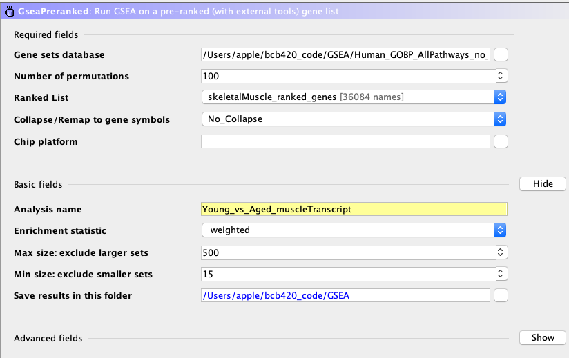
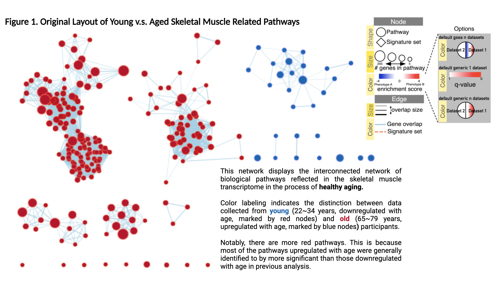
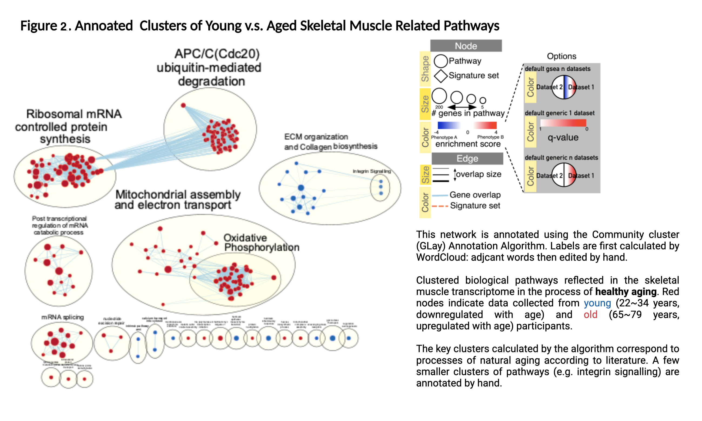
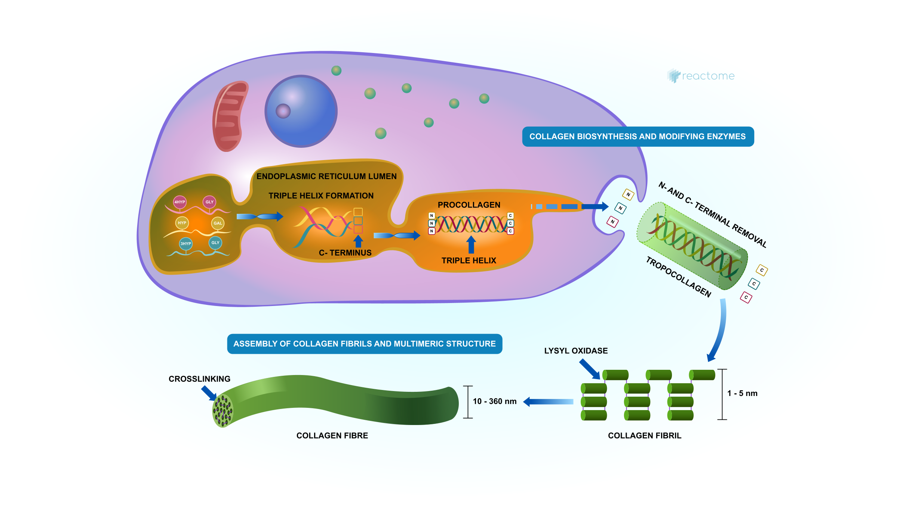
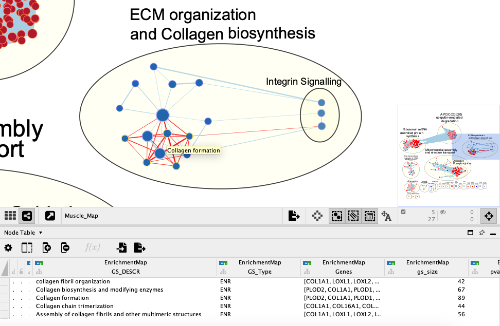
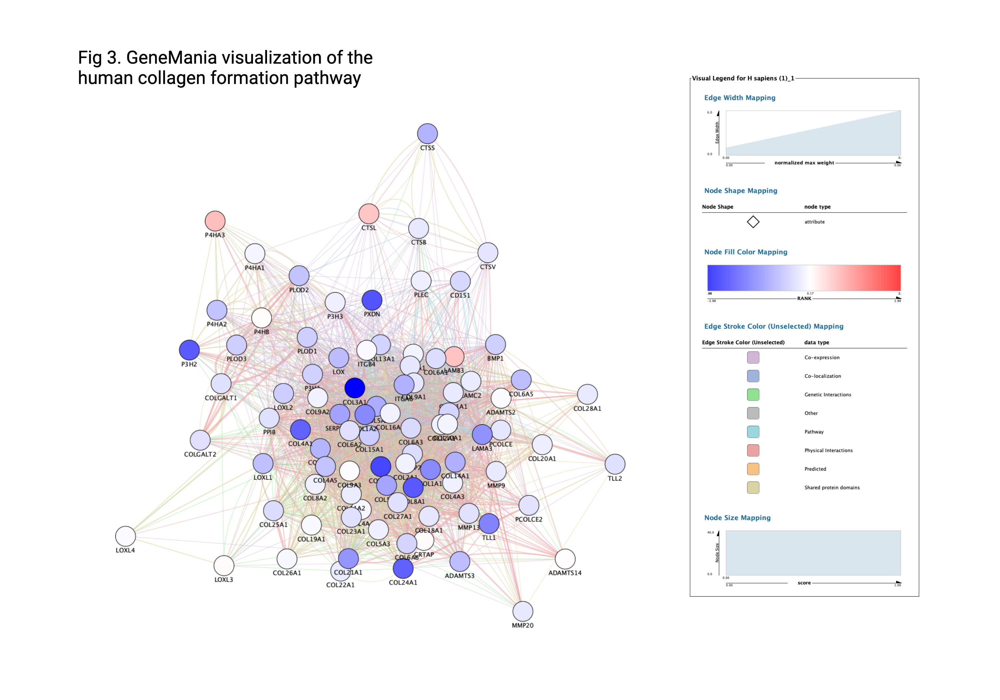

```{r Loading libraries & datasets, echo=FALSE, message=FALSE, results='hide'}
if (!requireNamespace("kableExtra", quietly = TRUE))
    invisible(BiocManager::install("kableExtra"))

if (!requireNamespace("circlize", quietly = TRUE))
    invisible(BiocManager::install("circlize"))

invisible(library(knitr))
invisible(library(kableExtra))
invisible(library(circlize))

#install required R and bioconductor packages
tryCatch(expr = { library("RCurl")}, 
         error = function(e) {  install.packages("RCurl")}, 
         finally = library("RCurl"))

tryCatch(expr = { library("BiocManager")}, 
         error = function(e) { 
           install.packages("BiocManager")}, 
         finally = library("BiocManager"))

tryCatch(expr = { library("ggplot2")}, 
         error = function(e) { install.packages("ggplot2")}, 
         finally = library("ggplot2"))

#use easy cyRest library to communicate with cytoscape.
tryCatch(expr = { library("RCy3")}, 
         error = function(e) { BiocManager::install("RCy3")}, 
         finally = library("RCy3"))
```

## Introduction to Dataset 

Data cleaning and normalization have been performed on a RNAseq dataset produced by a recent paper titled **Skeletal muscle transcriptome in healthy aging**, published in *Nature Communications* in 2021. The raw data was obtained from GEO with the ID **GSE164471** See the short bio below for some basic information of this dataset and its source.

#### <span style="text-decoration:underline">Dataset Meta Info</span> 
**Contact Location** : 251 Bayview Blvd,Baltimore,USA \
**Contact Institute** : NIA-IRP, NIH \
**Contact Department** : Laboratory of Genetics and Genomics \
**Contact Laboratory** : Computational Biology & Genomics Core

There are two supplemental files in this dataset: \
1). **Genes/RNAs (ENSG)** — GSE164471_GESTALT_Muscle_ENSG_counts_annotated.csv \
2). **Transcripts/isoforms (ENST)** — GSE164471_GESTALT_Muscle_ENST_TPM_annotated.csv \
In this study, the authors defined ENSGs as genes/RNAs and ENSTs as transcripts/isoforms. For the purpose of our analysis, we will focus on RNA data.

## Normalized Count Data
* Gene expression data is obtained from [Skeletal muscle transcriptome in healthy aging](https://www.nature.com/articles/s41467-021-22168-2#citeas)[@tumasian2021skeletal].

- Original raw data contains:\
**57,773 protein-coding and non-coding RNAs across 53 healthy individuals (22-83 years old)**\

- Filtered data with weakly expressed (low counts) genes removed contains\
**36,084 protein-coding and a few non-coding RNAs across 53 healthy individuals (22-83 years old)**\

**Rationale for high gene number**: Weakly expressed (low counts) genes were removed from raw data containing 57,773 protein-coding and non-coding RNAs across 53 healthy individuals (22-83 years old). 36,084 filtered gene list  purposely retained some degree of splice variants and low-count genes but that as the study aim is to compare complete skeletal muscle transcriptome of healthy young vs aged participants without particular focuse on any disease types.(Original study only removed 568 RNAs that were not expressed across any of the participants from analysis, leaving 57,770-568 = 57,205)

## Result Summary from g:Profiler ORA 
```{r}
ORA_Results <- data.frame(Geneset = c("Upregulated", "Downregulated", "All Differentially Expressed"), Number = c(578, 321, 899), Process = c("Cytoplasmic ribosomal protein translation", "regulation of anatomical structure morphogenesis", "regulation of anatomical structure morphogenesis"), FDR = c("<0.05", "<0.05", "<0.05"), P.adj = c(10e-32, 10e-15, 10e-24), Size = c("20 ~ 1000", "20 ~ 1000", "20 ~ 2000"))

colnames(ORA_Results) <- c("Geneset", "Number of Input Genes", "Main Enriched Process", "BH-FDR Threshold", "Approximate Adjusted P-val (from G:profiler)", "Term Size Limit")

kable(ORA_Results, "html", align = "llll")
```

(Note: Term size was set to included larger terms because we want to highlight some of the broader, more generalized pathways associated with muscle aging e.g. tissue development)

### Table of Notable Genes:

| Expression with age | Common Name (RNA Ensembl ID) | Padj     | Protein Coding | Associated Functions & Characteristics                                                                                 |
|---------------------|------------------------------|----------|----------------|------------------------------------------------------------------------------------------------------------------------|
| up                  | XIST(ENSG00000229807)        | 4.35E-08 | no             | Age-related X chromosome inactivation, can clinically result in late-onset X-linked disoders (e.g. muscular dystrophy) |
| up                  | C12orf75(ENSG00000235162)    | 3.05E-06 | yes            | Energy metabolism, insulin signalling, aging, skeletal muscle weakness                                                 |
| up                  | FAM83B(ENSG00000168143)      | 1.99E-05 | yes            | Hypoxia response pathway, aging, musclar dystrophy                                                                     |
|                     |                              |          |                |                                                                                                                        |
| down                | ACE2(ENSG00000130234)        | 4.35E-04 | yes            | Protection against age-associated muscle wasting  (e.g. DND)                                                           |
| down                | NPNT(ENSG00000168743)        | 5.18E-03 | yes            | Muscle cell niche maintenance, tissue injury repair and regeneration                                                   |
| down                | CNBP(ENSG00000168714)        | 9.98E-03 | yes            | Juvenile tissue development, abudant in the heart and skeletal muscles

**Interpretation**:\
For genes that are up-regulated with age, the top term identified across multiple databases is *"cytoplasmic ribosomal protein translation"*. This makes sense as aging is closely associated with the proteome, the gradual accumulation of mutations that arise in the aging process will lead to impaired protein synthesis. 

For genes that are down-regulated with age, large biological processes such as *"tissue development"* and *"regulation of anatomical structure morphogenesis"* are the top results returned by GO:BP. This makes sense as an organism's ability to generate new tissues, as well as the maintenance of structural orientation and signalling naturally deteriorate with age. 

Compared to ORA performed using lists of up and down-regulated gene separately, the combined gene list returned a combination of terms from both analysis, which is expected from the enrichment process. From the ORA result, we can see that the strength/significance of top pathways associated with up-regulated genes seem to trump the top terms associated with down-regulated genes. 

## Part 1: Non-thresholded Gene Expression [GSEA] 

As seen in the introduction above, there are distinct differences in gene expression (of the skeletal muscle transcriptome) between young and aged individuals. However, there are certain biases associated with thresholded analysis. To look beyond the differentially expressed genes at all expression profiles, we will employ **Non-thresholded Geneset Enrichment Analysis (GSEA)** to re-examine pathways that are upregulated/downregulated with age. 

### Method and geneset of choice 
* Setting for GSEA input parameters is shown in the screenshot below. **Geneset size limit is set to 15~500 here to excluded some overly large/generalized pathways.** According to GSEA results report, Gene set size filters (min=15, max=500) resulted in filtering out 12274 / 18545 gene sets. The remaining 6271 gene sets were used in the analysis.

* Input files:\

  + 1). **Human_GOBP_AllPathways_no_GO_iea_March_01_2022_symbol.gmt** as the pathway file since it is the most up-to-date human pathway documentation on the Bader lab website. Electronic annotations are excluded here.

  + 2). **skeletalMuscle_ranked_genes.rnk** (the calculated rnk file produced from A2) as the ranked file.



### Summary of enrichment results

Here in this table I present a few key interesting genesets produced by the enrichment process. They are among the top 10 pathways returned (ranked by significance) :\

| Expression with age | Pathway Name                                | Enrichment Score | Number of Genes | Associated Functions & Characteristics                                                                                                             |
|---------------------|---------------------------------------------|------------------|-----------------|----------------------------------------------------------------------------------------------------------------------------------------------------|
| up                  | NONSENSE-MEDIATED DECAY (NMD)               |             0.87 | 112             | Key surveillance pathway that safeguards the quality of mRNA transcripts in eukaryotic cells.                                                      |
| up                  | CYTOPLASMIC TRANSLATION                     |             0.86 | 121             | Manipulation of protein synthesis and translation-related signaling. Key quality control pathway.                                                  |
| up                  | OXIDATIVE PHOSPHORYLATION                   |             0.88 | 92              | Mitochondrial metabolic pathway in which energy used to form ATP is released. Impaired by aging.                                                   |
|                     |                                             |                  |                 |                                                                                                                                                    |
| down                | BETA INTEGRIN CELL SURFACE INTERACTIONS     |            -0.70 | 66              | Mediates intracellular signals in response to the extracellular matrix including cellular shape, mobility, and progression through the cell cycle. |
| down                | HALLMARK EPITHELIAL MESENCHYMAL TRANSITION  |            -0.62 | 146             | Genes defining epithelial-mesenchymal transition, as in wound healing, fibrosis and metastasis.                                                    |
| down                | COLLAGEN BIOSYNTHESIS AND MODIFYING ENZYMES |            -0.63 | 67              | Collagen synthesis provides important structural support to the extracellular space of connective tissues.                                         |

### Comparison between GSEA and ORA

The top most positively regulated genesets are highly similar across both analyses. Though clearly, GSEA includes a much wider breadth of processes than the thresholded ORA because more genes and expression data were used in the analysis. Take the top processes upregulated with age for example: **cytoplsmic translation** and **oxidative phosphorylation** is one of the top shared results, but there are many more nuanced protein translation/biosynthesis pathways being upregulated in the GSEA whereas the ORA was mostly enriched for ribosomal subunit biogenesis specifically.   

However, for the negatively regulated genesets, top results between GSEA and ORA seem to differ. Numerous **integrin signalling** related pathways were highlighted in the GSEA report, but these pathways were not found by the ORA. (Possibly due to large term size limit.) However, the two analyses do share many processes downregulated with age, such as those related to **collagen formation** and many others related to **structural integrity and morphogenesis**. 

Overall, no, this is not a straight forward comparison because we are using 36084 genes and their expression data for the GSEA, whereas in the thresholded ORA, only 899 genes were used. The inclusion of all normalized expression data definitely enhanced the enrichment process to included pathways that more accurately aligns with our expectations of age-related changes. This fact is apparent from our comparison. 

## Part 2: Visualizing GSEA Results in Cytoscape [Enrichment Map]

### Enrichment Map Parameters, Results, and Annotations

* Geneset Filtering Thresholds
  + FDR : 0.001 (only genesets significantly enriched at a value of 0.001 or less will be displayed on the map)
  + P-Value : 1
  
* Similarity Filtering
  + Jaccard-Overlap (50%)
  + Cutoff: 0.375
  + Combine edges across dataset

* # Resulting Nodes and Edges (prior to manual manipulation)
  + Nodes : 248
  + Edges : 4115

* Annotation: 
  + Cluster Algorithm: Community cluster (GLay) Annotation set
  + Label Algorithm: WordCloud-Adjacent Words (smaller clusters not defined by the algorithm were annotated by hand)

### Enrichment Map Visual Result Summary

#### Layout prior to manual manipulation:

```{r}

```

#### Theme network after manual manipulation, clustering, and annotations:

```{r}

```
* **Collapse your network to a theme network. What are the major themes present in this analysis? Do they fit with the model? Are there any novel pathways or themes?**

The major themes observed in this network belong to processes that are up 
regulated with age. As evident from Figure 2, main clusters representing processes in aged skeletal muscle include *APC/C(Cdc20) ubiquitin-mediated degradation*, *Mitochondrial assembly and electron transport*, as well as *Ribosomal mRNA controlled protein synthesis*. With ubiquitin-mediated degradation being the cluster with highest number of associated pathways. This theme describes the established phenomenon of reduced increased protein misfolding; reduced biosynthesis; decline in mitochondrial functions; and impaired intracellular protein degradation as an individual ages

For processes in young skeletal muscle, the main cluster is *ECM Organization and Collagen Biosynthesis*. Assembly of the extracellular matrix (ECM) is a crucial step in the embryonic development phase, it directly impacts the formation of functioning collagen fibrils needed to build muscle. These processes tend to deteriorate with age. It is important to note that there are other "themed" pathway that are down regulated with age, they are either relatively undocumented (since most researchers gravitates towards study of diseases and aged individuals) or found to be insignificant by my analysis. 

**Yes**, these themes do fit with the model of young vs aged skeletal muscle transcriptome profiles in healthy aging.

There are novel themes but admittedly these are in nodes that do not have much connectivity or are completely removed from the “main” pathways/genesets mentioned above. Visually, they seem to be outliers, however, some indicate potentially meaningful themes that are expected in muscle aging such as *morphogenesis of branching structure* and *hallmark of epithelial mesenchymal transition*.

## Part 3: Interpretation and Detailed Theme Selection
* **Do the enrichment results support conclusions or mechanism discussed in the original paper? How do these results differ from the results you got from Assignment #2 thresholded methods**

A portion of the enrichment map generated above is supported by the original publication. Authors of that study identified six significantly (p < 0.05) upregulated pathways in older (80+ years) compared to younger (20–34 years) participants: oxidative phosphorylation, adipogenesis, G2/M checkpoint, MTORC1 signaling, fatty acid metabolism, and ultraviolet response. 

The enriched theme **Oxidative phosphorylation** best aligns with the author's conclusion. Additionally, **G2/M DNA damage checkpoint** is an important cell cycle checkpoint in eukaryotic organisms that ensures that cells don't initiate mitosis until damaged or incompletely replicated DNA is sufficiently repaired (Taylor and Start, 2001). And **MTORC1 signaling** controls protein synthesis by activating S6 kinase 1 (S6K1) and inhibiting 4E-binding protein 1 (4EBP1). (Ma and Blenis, 2009) Both are important regulators and drivers of protein synthesis, which fits in to the broad theme that our analysis has identified. The authors also highlighted mitochondrial function decline with age, as well as the key role of ECM proteins in muscle growth, both are reflected in our analysis. 

* **Can you find evidence, i.e. publications, to support some of the results that you see. How does this evidence support your result?**

Ubiquitin-mediated protein degradation was one of the largest cluster of biological processes identified by our enrichment analysis. However, this was not mentioned by authors of the original paper. In a brief literature dive, I found that muscle atrophy in adult tissue often occurs when protein degradation rates exceed protein synthesis (Bren et al, 2011). As this [2013 paper](https://www.ncbi.nlm.nih.gov/pmc/articles/PMC3775123/#:~:text=Muscle%20atrophy%20in%20adult%20tissue,the%20loss%20of%20muscle%20mass.) describes: two major protein degradation pathways, the ubiquitin-proteasome and the autophagy-lysosome systems, are activated during muscle atrophy and variably contribute to the loss of muscle mass.

However, recent literature does not indicate that this pathway is restricted to the healthy aging process. "Denervation, fasting, heart failure, aging and sarcopenia are equally likely root causes of ubiquitin-mediated protein deterioration" (Geng et al., 2011). Overall, we can safely say that this theme is indeed relevant to the aging process, though it is not restricted to only that cause.

### Detailed Look at Collage Formation: [Blue nodes in E.M., downregulated with age]
```{r}

```

* Note: The above diagram is obtained from the [REACTOME database](https://reactome.org/PathwayBrowser/#/R-HSA-1474290&PATH=R-HSA-1474244)

#### Background: 
**Collagen is the major structural protein in skeletal muscle ECM; it accounts for 1–10% of muscle mass dry weight. They are important infrastructure for not only the skeletal muscle, but a variety of different body tissues. As individuals age, their bodies starts producing less collagen. Meanwhile, rigid adipose tissues and aged collagen accumulates as regenerative ability declines. Leading to thinner, drier, and less elastic skin, and more rigin muscles, and more brittle bone structures. This process is inevitable even with regular exercise and a healthy diet.**

Some of the main steps in collagen formation shown in the REACTOME diagram view can be found in our enrichment map results: 
* **Collagen biosynthesis and modifying enzymes**
* **Collagen chain trimerization**
* **Collagen fibril formation/assembly**
```{r}

```
As shown below, majority gene nodes in the **Collagen Formation** pathways are colored in blue, only a few are slightly pink. This reflect the distinct separation between young and aged biological processes we see in the enrichment map above. 

```{r}

```


## Assignment Journal can be found [here](https://github.com/bcb420-2022/Karen_Kuang/wiki/Assignment-3)

## References